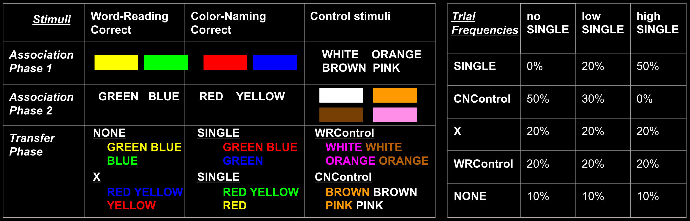
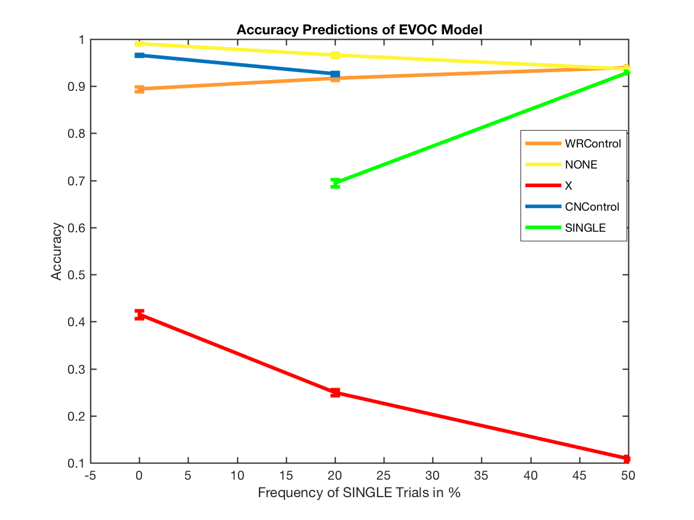
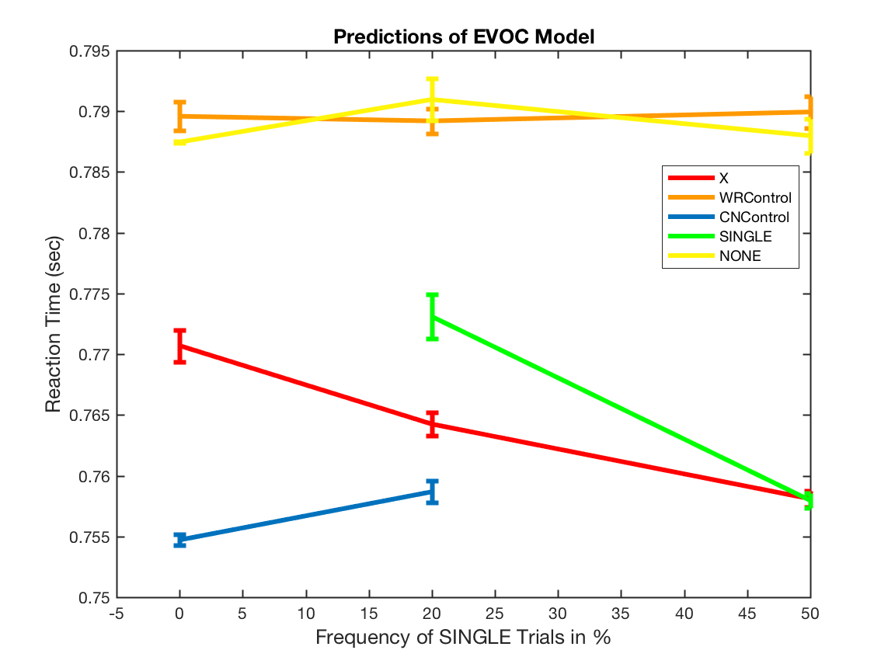
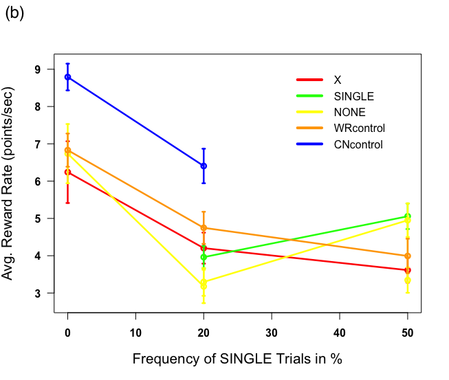

```{r setup, include=FALSE}
knitr::opts_chunk$set(echo = TRUE)
knitr::opts_knit$set(root.dir = "~/Dropbox/Laura_Misestimation_EVC/VSXv4")

```

# VSXv4
## Experiment details 

Learn color mapping key presses - 80 trials for 8 colors, if below 80% accuracy repeat once.<br>
Participants paid one dollar for every 200 points earned. <br>

<div id="bg">
  
</div>  

<b>Training Phase 1</b> <br>
160 trials<br>
5 point reward for each correct response<br>

<b>Training Phase 2</b> <br>
160 trials<br>
5 point reward for each correct response<br>

<b>Test Phase</b> <br>
200 trials<br>
10 point reward for each correct response<br>

Three groups, n=10 subjects per group<br>

3600 total points available paid at 200 points per dollar <br>


```{r load, echo = FALSE, message=FALSE, warning=FALSE}
setwd("~/Dropbox/Laura_Misestimation_EVC/VSXv4")
data_full <- readr::read_csv("VSXv4_021517.csv", na = 'NaN')
#load("VSXv4_021517.Rda")

#set-up packages... 
library(dplyr)
library(plyr)
library(tidyr)
library(tidyverse) 
library(magrittr) #for piping 
library(caTools) #for runmean function
library(ggplot2)
#tidy data    # *** M&D dplyr::rename won't work for this 
data <- data_full %>% 
      plyr::rename(c("IV_EITHERfreq" = "IV_SINGLEfreq", 
                   "IV_namingisRewarded" = "rewCN", 
                   "IV_readingisRewarded" = "rewWR",
                   "IV_RewEarned" = "DV_rewEarned")) %>% 
      dplyr::mutate(trialTypeName_full = recode(IV_trialType, '0' = "PRACTICE", 
                                  '1' = "X", '2' = "SINGLE_C", 
                                  '3' = "SINGLE_W", '4' = "NONE", 
                                  '5' = "WRControl", '6' = "CNControl")) %>%
      dplyr::mutate(trialTypeCode = recode(IV_trialType, '0' = NaN,  #could do recode_factor
                                  '1' = 1, '2' = 2, 
                                  '3' = 2, '4' = 3, 
                                  '5' = 4, '6' = 5)) %>%
      dplyr::mutate(trialTypeName = recode(trialTypeCode, 
                                          '1' = "X", '2' = "SINGLE", '3' = "NONE", 
                                          '4' = "WRControl", '5' = "CNControl")) %>%
      dplyr::mutate(SINGLEfreq = recode(IV_SINGLEfreq, '1' = 0, '2' = 20, '3' = 50), 
                  isError = ((DV_isCorrect * - 1) + 1)) %>%
    #controlled response error is when response == colPresented
    # automatic response error is when response == strPresented
      dplyr::mutate(isError_controlresponse = ifelse(response == colPresented & 
                                                     rewCN == 0, 1, 0), 
                    isError_automaticresponse = ifelse(response == strPresented & 
                                                       rewWR == 0, 1, 0)) %>%
    # erroneous error is response ~= strPresented ~= colPresented 
      dplyr::mutate(isErroneous_response = (data_full$response != data_full$colPresented 
                                            & data_full$response != data_full$strPresented))                   # ** M&D hard time wrangling this

#count number of subjects per group
n_noSINGLEfreq <- data %>% filter(IV_SINGLEfreq == 1) %$% dplyr::n_distinct(subID)
n_loSINGLEfreq <- data %>% filter(IV_SINGLEfreq == 2) %$% dplyr::n_distinct(subID)
n_hiSINGLEfreq <- data %>% filter(IV_SINGLEfreq == 3) %$% dplyr::n_distinct(subID)
#if this is balanced, use number of subjects "n_perfreq" to calculate SEM
if (n_noSINGLEfreq == n_loSINGLEfreq & n_noSINGLEfreq == n_hiSINGLEfreq) {n_perfreq <- n_noSINGLEfreq} else {n_perfreq <- NaN}

```

# Human Summary Plots

#Accuracy data 

```{r accuracy_means, echo = TRUE, message=FALSE, warning=FALSE}
#summary accuracy by trialType
#mean and sem for all subjects
group_accuracy <- data %>% 
              filter(!is.na(trialTypeName)) %>% 
              group_by(subID, SINGLEfreq, trialTypeName) %>% 
              dplyr::summarise(sCorrect = mean(DV_isCorrect, na.rm = TRUE)) %T>% 
              print() %>% #let us see all subject means %<>% #this pipe also could be %$%,   then .'s would be necesary following this 
              group_by(SINGLEfreq, trialTypeName) %>% 
              dplyr::summarise(Correct = mean(sCorrect), 
                               semCorrect = (sd(sCorrect, na.rm = TRUE) / sqrt(n_perfreq))) %T>%   print()

#plot accuracy by trialType 
ggplot(data = group_by(group_accuracy, trialTypeName), aes(x = SINGLEfreq, y = Correct)) + geom_point(aes(colour = factor(trialTypeName))) + geom_line(aes(colour = factor(trialTypeName))) + geom_errorbar(aes(ymax = Correct + semCorrect,
              ymin = Correct - semCorrect), position = "dodge", width = 0.25) + labs(title = "correct", x = "SINGLE Frequency", y = "Accuracy") 

```

```{r error_means, echo = TRUE, message=FALSE, warning=FALSE}
#summary error by trialType
group_error <- data %>% filter(!is.na(trialTypeName)) %>% 
  group_by(subID, SINGLEfreq, trialTypeName) %>% 
  dplyr::summarise(sError = mean(isError, na.rm = TRUE)) %T>% 
  print() %>%
  group_by(SINGLEfreq, trialTypeName) %>% 
  dplyr::summarise(Error = mean(sError), Error_sem = (sd(sError, na.rm = TRUE) / sqrt(n_perfreq))) %T>% print()

#plot error by trialType 
ggplot(data = group_by(group_error, trialTypeName), aes(x = SINGLEfreq, y = Error)) + 
  geom_point(aes(colour = factor(trialTypeName))) + 
  geom_line(aes(colour = factor(trialTypeName))) + 
  geom_errorbar(aes(x = SINGLEfreq, ymax = (Error + Error_sem), 
                    ymin = (Error - Error_sem)), 
                position = "dodge", width = 0.25) + 
  labs(title = "Errors", x = "SINGLE Frequency", y = "Proportion Errors") 

```

```{r controlled_response, echo = TRUE, message=FALSE, warning=FALSE}

#summary controlled respone error by trialType
group_error_controlresponse <- data %>% filter(!is.na(trialTypeName)) %>% 
  group_by(subID, SINGLEfreq, trialTypeName) %>% 
  dplyr::summarise(sError_cr = mean(isError_controlresponse, na.rm = TRUE)) %T>% 
  print() %>%
  group_by(SINGLEfreq, trialTypeName) %>% 
  dplyr::summarise(Error_controlresponse = mean(sError_cr), Error_controlresponse_sem = (sd(sError_cr, na.rm = TRUE) / sqrt(n_perfreq))) %T>% print()

#plot controlled respone error by trialType 
ggplot(data = group_by(group_error_controlresponse, trialTypeName), 
       aes(x = SINGLEfreq, y = Error_controlresponse)) + 
      geom_point(aes(colour = factor(trialTypeName))) + 
      geom_line(aes(colour = factor(trialTypeName))) + 
      geom_errorbar(aes(x = SINGLEfreq, 
                        ymax = (Error_controlresponse + Error_controlresponse_sem), 
                        ymin = (Error_controlresponse - Error_controlresponse_sem)), 
                    position = "dodge", width = 0.25) + 
      labs(title = "Controlled Response Errors", 
       x = "SINGLE Frequency", 
       y = "Proportion Controlled Response Errors") 

#proportion of overall errors
group_error_controlresponse_prop <- data %>% filter(!is.na(trialTypeName), isError == 1) %>% 
  group_by(subID, SINGLEfreq, trialTypeName) %>% 
  dplyr::summarise(sError_cr = mean(isError_controlresponse, na.rm = TRUE)) %T>% 
  print() %>%
  group_by(SINGLEfreq, trialTypeName) %>% 
  dplyr::summarise(Error_controlresponse = mean(sError_cr), Error_controlresponse_sem = (sd(sError_cr, na.rm = TRUE) / sqrt(n_perfreq))) %T>% print()

ggplot(data = group_by(group_error_controlresponse_prop, trialTypeName), 
       aes(x = SINGLEfreq, y = Error_controlresponse)) + 
      geom_point(aes(colour = factor(trialTypeName))) + 
      geom_line(aes(colour = factor(trialTypeName))) + 
      geom_errorbar(aes(x = SINGLEfreq, 
                        ymax = (Error_controlresponse + Error_controlresponse_sem), 
                        ymin = (Error_controlresponse - Error_controlresponse_sem)), 
                    position = "dodge", width = 0.25) + 
      labs(title = "Proportion of errors Controlled Response", 
       x = "SINGLE Frequency", 
       y = "Proportion Controlled Response Errors") 
```

```{r automatic_response, echo = TRUE, message=FALSE, warning=FALSE}

#proportion of overall errors
group_error_automaticresponse_prop <- data %>% 
  filter(!is.na(trialTypeName), isError == 1) %>% 
  group_by(subID, SINGLEfreq, trialTypeName) %>% 
  dplyr::summarise(sError_ar = mean(isError_automaticresponse, na.rm = TRUE)) %T>% 
  print() %>%
  group_by(SINGLEfreq, trialTypeName) %>% 
  dplyr::summarise(Error_automaticresponse = mean(sError_ar), 
                   Error_automaticresponse_sem = (sd(sError_ar, na.rm = TRUE) / sqrt(n_perfreq))) %T>% 
  print()

ggplot(data = group_by(group_error_automaticresponse_prop, trialTypeName), 
       aes(x = SINGLEfreq, y = Error_automaticresponse)) + 
      geom_point(aes(colour = factor(trialTypeName))) + 
      geom_line(aes(colour = factor(trialTypeName))) + 
      geom_errorbar(aes(x = SINGLEfreq, 
                        ymax = (Error_automaticresponse + Error_automaticresponse_sem), 
                        ymin = (Error_automaticresponse - Error_automaticresponse_sem)), 
                    position = "dodge", width = 0.25) + 
      labs(title = "Proportion of errors  Automatic Response", 
       x = "SINGLE Frequency", 
       y = "Proportion Automatic Response Errors") 
```

```{r erroneous_response, echo = TRUE, message=FALSE, warning=FALSE}

#proportion of overall errors
group_error_erroneousresponse_prop <- data %>% 
  filter(!is.na(trialTypeName), isError == 1) %>% 
  group_by(subID, SINGLEfreq, trialTypeName) %>% 
  dplyr::summarise(sError_er = mean(isErroneous_response, na.rm = TRUE)) %T>% 
  print() %>%
  group_by(SINGLEfreq, trialTypeName) %>% 
  dplyr::summarise(Error_erroneousresponse = mean(sError_er), 
                   Error_erroneousresponse_sem = (sd(sError_er, na.rm = TRUE) / sqrt(n_perfreq))) %T>% 
  print()

ggplot(data = group_by(group_error_erroneousresponse_prop, trialTypeName), 
       aes(x = SINGLEfreq, y = Error_erroneousresponse)) + 
      geom_point(aes(colour = factor(trialTypeName))) + 
      geom_line(aes(colour = factor(trialTypeName))) + 
      geom_errorbar(aes(x = SINGLEfreq, 
                        ymax = (Error_erroneousresponse + Error_erroneousresponse_sem), 
                        ymin = (Error_erroneousresponse - Error_erroneousresponse_sem)), 
                    position = "dodge", width = 0.25) + 
      labs(title = "Proportion of errors  erroneous Response", 
       x = "SINGLE Frequency", 
       y = "Proportion Erroneous Response Errors") 
```


# Correct Reaction Times

```{r correct_RT, echo = TRUE}

#Look at RTs on just correct trials 
group_RT <- data %>% filter(DV_isCorrect == 1, !is.na(trialTypeName)) %>% 
  group_by(subID, SINGLEfreq, trialTypeName) %>% 
  dplyr::summarise(sRT = mean(DV_trialRT, na.rm = TRUE)) %T>% 
  print() %$% #let us see all subject means
  group_by(., SINGLEfreq, trialTypeName) %>% 
  dplyr::summarise(., mean_RT = mean(sRT), semRT = (sd(sRT, na.rm = TRUE) / sqrt(n_perfreq))) %T>% print()
  #mean and sem for all subjects

#plot correct trial RT by trial type 
pRT <- ggplot(data = group_by(group_RT, trialTypeName), aes(x = SINGLEfreq, y = mean_RT)) 
dodge <- position_dodge(width = 0.9)
limits <- aes(ymax = group_RT$mean_RT + group_RT$semRT,
              ymin = group_RT$mean_RT - group_RT$semRT)
pRT + geom_point(aes(colour = factor(trialTypeName))) + geom_line(aes(colour = factor(trialTypeName))) + geom_errorbar(limits, position = dodge, width = 0.25) + labs(title = "correct RT", x = "SINGLE Frequency", y = "RT (ms)") 
```

```{r correct_RT_hist, echo = TRUE, fig.width=15, fig.height= 10}

#correct RT histograms by trial type 
transferPhase_correctRT <- data %>% filter(DV_isCorrect == 1, IV_Phase == 3)
RThist <- ggplot(data = transferPhase_correctRT, aes(DV_trialRT)) + geom_histogram(aes(colour = factor(trialTypeName)), binwidth = 75)
RThist + facet_grid(SINGLEfreq ~ trialTypeName, labeller = labeller(.cols = label_value, .rows = label_both)) + labs(title = "correct RT") 

```

# ERROR Reaction Times

```{r error_RT, echo = FALSE}

#Look at RTs on just error trials 
group_errorRT <- data %>% filter(DV_isCorrect == 0, !is.na(trialTypeName)) %>% 
  group_by(subID, SINGLEfreq, trialTypeName) %>% 
  dplyr::summarise(sRT = mean(DV_trialRT, na.rm = TRUE)) %T>% 
  print() %$% #let us see all subject means
  group_by(., SINGLEfreq, trialTypeName) %>% 
  dplyr::summarise(., mean_RT = mean(sRT), semRT = (sd(sRT, na.rm = TRUE) / sqrt(n_perfreq))) %T>% print()
  #mean and sem for all subjects

#plot error trial RT by trial type 
pRT <- ggplot(data = group_by(group_errorRT, trialTypeName), aes(x = SINGLEfreq, y = mean_RT)) 
dodge <- position_dodge(width = 0.9)
limits <- aes(ymax = group_errorRT$mean_RT + group_errorRT$semRT,
              ymin = group_errorRT$mean_RT - group_errorRT$semRT)
pRT + geom_point(aes(colour = factor(trialTypeName))) + geom_line(aes(colour = factor(trialTypeName))) + geom_errorbar(limits, position = dodge, width = 0.25) + labs(title = "Error RT", x = "SINGLE Frequency", y = "RT (ms)") 
```

```{r error_RT_hist, echo = TRUE, fig.width=15, fig.height= 10}

#error RT histograms by trial type 
transferPhase_errorRT <- data %>% filter(DV_isCorrect == 0, IV_Phase == 3)
RThist <- ggplot(data = transferPhase_errorRT, aes(DV_trialRT)) + geom_histogram(aes(colour = factor(trialTypeName)), binwidth = 75)
RThist + facet_grid(SINGLEfreq ~ trialTypeName, labeller = labeller(.cols = label_value, .rows = label_both)) + labs(title = "error RT") 

```

#Model Predictions Data 

## model accuracy 
<div id="bg">
  
</div>  

## model RT 
<div id="bg">
  
</div> 

## to do: human reward rate by trial type 
<div id="bg">
  
</div> 


#LEARNING 

```{r learning_association, echo = TRUE, message=FALSE, warning=FALSE}
#look at trials during Association phase I and II

#association phase I
#look at trials where CN was rewarded
#initialize vector
learn_associationIrewCN <- vector()
#loop through every subject
for (i in unique(data$subID)) {
  tmpsub <- data %>% filter(IV_Phase == 1, rewCN == 1, 
                            subID == i)
  # get vector of accuracy by taking average of performance in 10 trial windows, omit nans
  tmpacc <- runmean(na.omit(tmpsub$DV_isCorrect), 10, alg = "R")
  learn_associationIrewCN <- rbind(learn_associationIrewCN, tmpacc)
}
plot(colMeans(learn_associationIrewCN), main = "Association I, rewCN trial accuracy", xlab = "Trial (10 Trial Sliding Window)", ylab = "Proportion Correct")

#association phase I
#look at trials where WR was rewarded
#initialize vector
learn_associationIrewWR <- vector()
#loop through every subject
for (i in unique(data$subID)) {
  tmpsub <- data %>% filter(IV_Phase == 1, rewCN == 0, 
                            subID == i)
  # get vector of accuracy by taking average of performance in 10 trial windows, omit nans
  tmpacc <- runmean(na.omit(tmpsub$DV_isCorrect), 10, alg = "R")
  learn_associationIrewWR <- rbind(learn_associationIrewWR, tmpacc)
}
plot(colMeans(learn_associationIrewWR), main = "Association I, rewWR trial accuracy", xlab = "Trial (10 Trial Sliding Window)", ylab = "Proportion Correct")

#association phase II
#look at trials where CN was rewarded
#initialize vector
learn_associationIIrewCN <- vector()
#loop through every subject
for (i in unique(data$subID)) {
  tmpsub <- data %>% filter(IV_Phase == 2, rewCN == 1, 
                            subID == i)
  # get vector of accuracy by taking average of performance in 10 trial windows, omit nans
  tmpacc <- runmean(na.omit(tmpsub$DV_isCorrect), 10, alg = "R")
  learn_associationIIrewCN <- rbind(learn_associationIIrewCN, tmpacc)
}
plot(colMeans(learn_associationIIrewCN), main = "Association II, rewCN trial accuracy", xlab = "Trial (10 Trial Sliding Window)", ylab = "Proportion Correct")

#association phase II
#look at trials where WR was rewarded
#initialize vector
learn_associationIIrewWR <- vector()
#loop through every subject
for (i in unique(data$subID)) {
  tmpsub <- data %>% filter(IV_Phase == 2, rewCN == 0, 
                            subID == i)
  # get vector of accuracy by taking average of performance in 10 trial windows, omit nans
  tmpacc <- runmean(na.omit(tmpsub$DV_isCorrect), 10, alg = "R")
  learn_associationIIrewWR <- rbind(learn_associationIIrewWR, tmpacc)
}
plot(colMeans(learn_associationIIrewWR), main = "Association II, rewWR trial accuracy", xlab = "Trial (10 Trial Sliding Window)", ylab = "Proportion Correct")
```

```{r learning_transfer, echo = FALSE, message=FALSE, warning=FALSE}
#generic function where you input the filtered data you want learning averages for
learning <- function(learn_subset_data) {
  learn_subset <- vector()
  for (i in unique(learn_subset_data$subID)) {
  tmpsub <- learn_subset_data %>% filter(subID == i)
  # get vector of accuracy by taking average of performance in 10 trial windows, omit nans
  tmpacc <- runmean(na.omit(tmpsub$DV_isCorrect), 10, alg = "R")
  learn_subset <- rbind(learn_subset, tmpacc)
  }
  return(learn_subset)
}

#Transfer phase learning for each trial type 

#take mean of learning trajectory across subjects to plot 
avglearning <- function(wSINGLEfreq, Phase, trialType){
  learn_subset_mean <- as.data.frame(colMeans(learning((filter(data, IV_SINGLEfreq == wSINGLEfreq, IV_Phase == Phase, IV_trialType == trialType)))))
  return(learn_subset_mean)
}
```

Accuracy for each trial type is averaged over 10 trial windows across all presentations of that trial type. For trials with higher frequency in the 200 total trials these plots are longer. 

## colors follow color scheme of earlier figures  
```{r learning_plot_freqGroup,  echo = FALSE, message=FALSE, warning=FALSE}
#no SINGLE
ggplot() + geom_point(data = avglearning(1, 3, 1), aes(x = 1:nrow(avglearning(1, 3, 1)), y = avglearning(1, 3, 1)), color = "red") + geom_point(data = avglearning(1, 3, 4), aes(x = 1:nrow(avglearning(1, 3, 4)), y = avglearning(1, 3, 4)), color = "yellow") + geom_point(data = avglearning(1, 3, 5), aes(x = 1:nrow(avglearning(1, 3, 5)), y = avglearning(1, 3, 5)), color = "orange") + geom_point(data = avglearning(1, 3, 6), aes(x = 1:nrow(avglearning(1, 3, 6)), y = avglearning(1, 3, 6)), color = "blue") + labs(title = "Accuracy by Trial Type, no SINGLE", x = "Transfer Trial (10 Trial Sliding Window)", y = "Proportion Correct")

#low SINGLE
ggplot() + geom_point(data = avglearning(2, 3, 1), aes(x = 1:nrow(avglearning(2, 3, 1)), y = avglearning(2, 3, 1)), color = "red") + geom_point(data = avglearning(2, 3, 2), aes(x = 1:nrow(avglearning(2, 3, 2)), y = avglearning(2, 3, 2)), color = "green") + geom_point(data = avglearning(2, 3, 3), aes(x = 1:nrow(avglearning(2, 3, 3)), y = avglearning(2, 3, 3)), color = "green") + geom_point(data = avglearning(2, 3, 4), aes(x = 1:nrow(avglearning(2, 3, 4)), y = avglearning(2, 3, 4)), color = "yellow") + geom_point(data = avglearning(2, 3, 5), aes(x = 1:nrow(avglearning(2, 3, 5)), y = avglearning(2, 3, 5)), color = "orange") + geom_point(data = avglearning(2, 3, 6), aes(x = 1:nrow(avglearning(2, 3, 6)), y = avglearning(2, 3, 6)), color = "blue")  + labs(title = "Accuracy by Trial Type, low SINGLE", x = "Transfer Trial (10 Trial Sliding Window)", y = "Proportion Correct")

#high SINGLE
ggplot() + geom_point(data = avglearning(2, 3, 1), aes(x = 1:nrow(avglearning(2, 3, 1)), y = avglearning(2, 3, 1)), color = "red") + geom_point(data = avglearning(2, 3, 2), aes(x = 1:nrow(avglearning(2, 3, 2)), y = avglearning(2, 3, 2)), color = "green") + geom_point(data = avglearning(2, 3, 3), aes(x = 1:nrow(avglearning(2, 3, 3)), y = avglearning(2, 3, 3)), color = "green") + geom_point(data = avglearning(2, 3, 4), aes(x = 1:nrow(avglearning(2, 3, 4)), y = avglearning(2, 3, 4)), color = "yellow") + geom_point(data = avglearning(2, 3, 5), aes(x = 1:nrow(avglearning(2, 3, 5)), y = avglearning(2, 3, 5)), color = "orange") + geom_point(data = avglearning(2, 3, 6), aes(x = 1:nrow(avglearning(2, 3, 6)), y = avglearning(2, 3, 6)), color = "blue") + labs(title = "Accuracy by Trial Type, high SINGLE", x = "Transfer Trial (10 Trial Sliding Window)", y = "Proportion Correct") 
```

## Gold color is no SINGLE, brown color is low SINGLE, tan color is high SINGLE
```{r learning_plot_trialType,echo = FALSE, message=FALSE, warning=FALSE}
#X trials by frequency group 
ggplot() + geom_point(data = avglearning(1, 3, 1), aes(x = 1:nrow(avglearning(1, 3, 1)), y = avglearning(1, 3, 1)), color = "goldenrod2") + geom_point(data = avglearning(2, 3, 1), aes(x = 1:nrow(avglearning(2, 3, 1)), y = avglearning(2, 3, 1)), color = "tan4") + geom_point(data = avglearning(3, 3, 1), aes(x = 1:nrow(avglearning(3, 3, 1)), y = avglearning(3, 3, 1)), color = "sienna3")  + labs(title = "X Trial Accuracy by Frequency Group", x = "Transfer Trial (10 Trial Sliding Window)", y = "Proportion Correct") 

#WRControl trials by frequency group 
ggplot() + geom_point(data = avglearning(1, 3, 5), aes(x = 1:nrow(avglearning(1, 3, 5)), y = avglearning(1, 3, 5)), color = "goldenrod2") + geom_point(data = avglearning(2, 3, 5), aes(x = 1:nrow(avglearning(2, 3, 5)), y = avglearning(2, 3, 5)), color = "tan4") + geom_point(data = avglearning(3, 3, 5), aes(x = 1:nrow(avglearning(3, 3, 5)), y = avglearning(3, 3, 5)), color = "sienna3")  + labs(title = "WRControl Trial Accuracy by Frequency Group", x = "Transfer Trial (10 Trial Sliding Window)", y = "Proportion Correct") 

#SINGLE trials by frequency group 
# plot SINGLE_word and SINGLE_color separately 
ggplot() + geom_point(data = avglearning(2, 3, 2), aes(x = 1:nrow(avglearning(2, 3, 2)), y = avglearning(2, 3, 2)), color = "tan4") + geom_point(data = avglearning(3, 3, 2), aes(x = 1:nrow(avglearning(3, 3, 2)), y = avglearning(3, 3, 2)), color = "sienna3") + geom_point(data = avglearning(2, 3, 3), aes(x = 1:nrow(avglearning(2, 3, 3)), y = avglearning(2, 3, 3)), color = "tan1") + geom_point(data = avglearning(3, 3, 3), aes(x = 1:nrow(avglearning(3, 3, 3)), y = avglearning(3, 3, 3)), color = "sienna1")  + labs(title = "SINGLE Trial Accuracy by Frequency Group", x = "Transfer Trial (10 Trial Sliding Window)", y = "Proportion Correct") 

#NONE trials by frequency group 
ggplot() + geom_point(data = avglearning(1, 3, 4), aes(x = 1:nrow(avglearning(1, 3, 4)), y = avglearning(1, 3, 4)), color = "goldenrod2") + geom_point(data = avglearning(2, 3, 4), aes(x = 1:nrow(avglearning(2, 3, 4)), y = avglearning(2, 3, 4)), color = "tan4") + geom_point(data = avglearning(3, 3, 4), aes(x = 1:nrow(avglearning(3, 3, 4)), y = avglearning(3, 3, 4)), color = "sienna3")  + labs(title = "NONE Trial Accuracy by Frequency Group", x = "Transfer Trial (10 Trial Sliding Window)", y = "Proportion Correct") 

#CNControl trials by frequency group 
ggplot() + geom_point(data = avglearning(1, 3, 6), aes(x = 1:nrow(avglearning(1, 3, 6)), y = avglearning(1, 3, 6)), color = "goldenrod2") + geom_point(data = avglearning(2, 3, 6), aes(x = 1:nrow(avglearning(2, 3, 6)), y = avglearning(2, 3, 6)), color = "tan4") + labs(title = "CNControl Trial Accuracy by Frequency Group", x = "Transfer Trial (10 Trial Sliding Window)", y = "Proportion Correct") 

#next steps for loops to collapse trial types 
#for (t in unique(data$IV_trialType)){}

```


